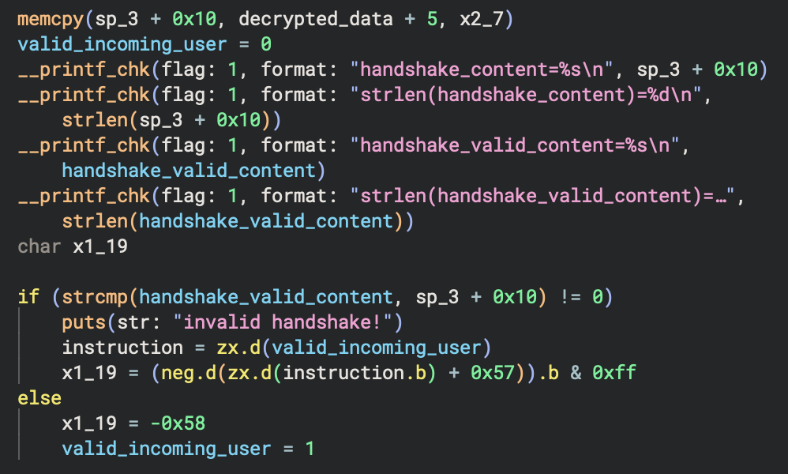
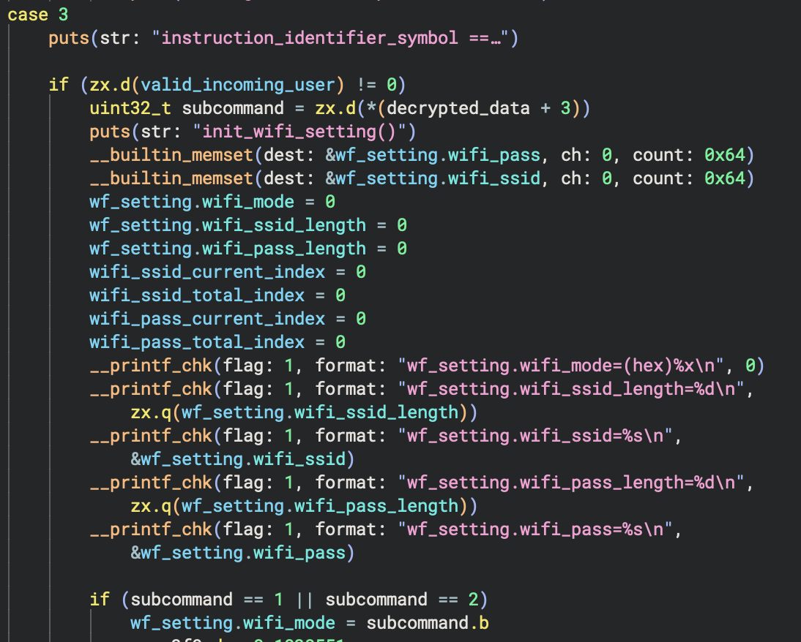
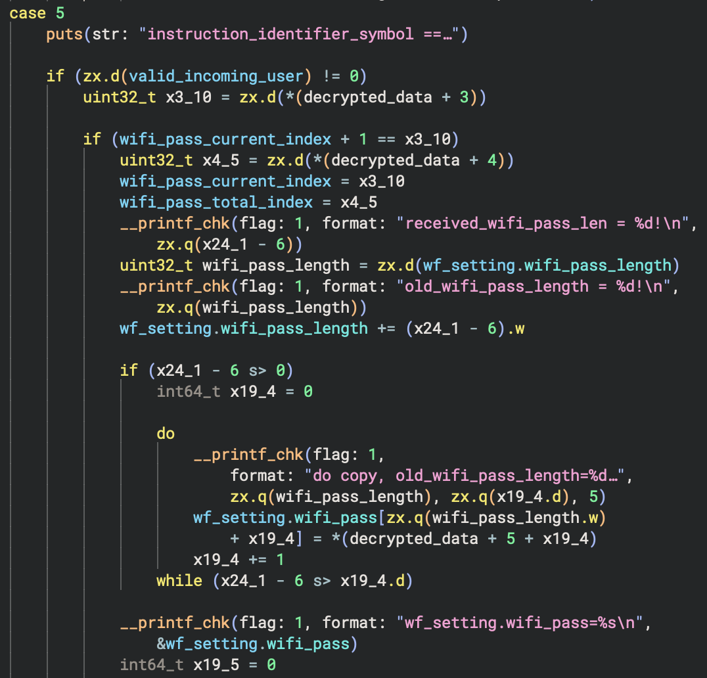
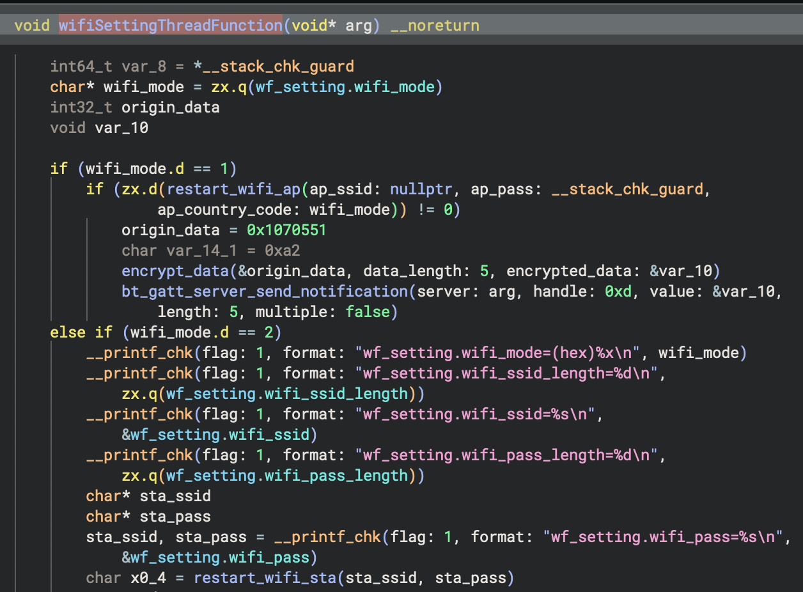
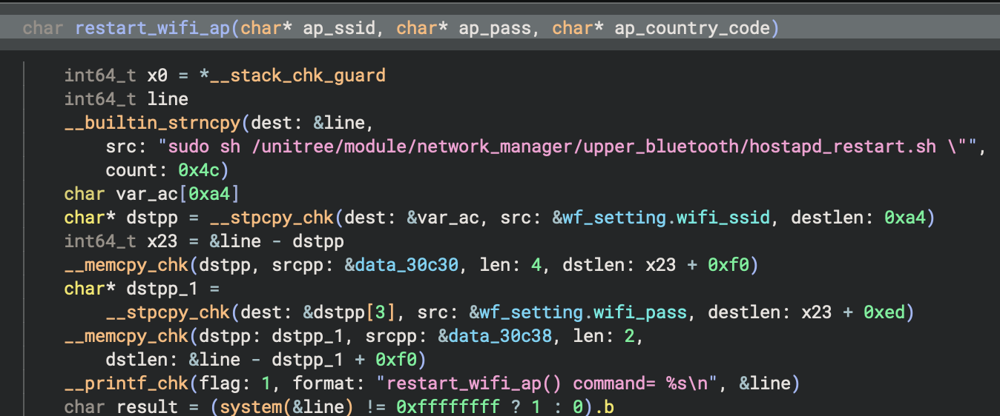
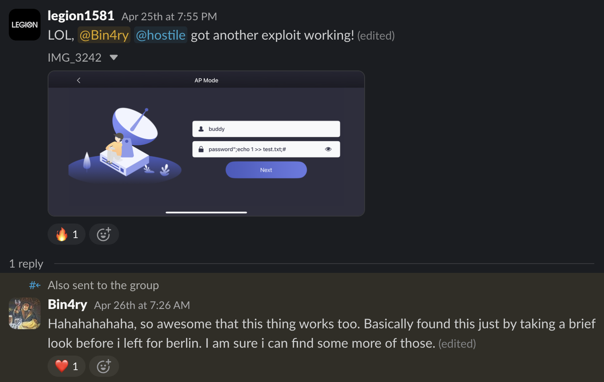

# Unitree Robot BLE Service Command Injection Analysis


**Author:** Bin4ry aka Andreas Makris [andreas.makris@gmail.com]  
**Co-Author:** h0stile aka Kevin Finisterre  
**Contributor:** legion1581 aka Konstantin Severov from [theroboverse](https://theroboverse.com/) helped to fix the payload for the injection and proved it with a fully working PoC :slightly_smiling_face: thanks dude, this was a critical contribution, very much appreciated!

**Date:** September 20, 2025  

## CVEs 

[CVE-2025-35027](https://takeonme.org/cves/cve-2025-35027/)  
[CVE-2025-60017](https://cve.org/CVERecord?id=CVE-2025-60017)  
[CVE-2025-60250](https://cve.org/CVERecord?id=CVE-2025-60250)  
[CVE-2025-60251](https://cve.org/CVERecord?id=CVE-2025-60251)

## Paper
The research from this repo is incorporated into a paper that presents a systematic security assessment of the Unitree G1 .  
Link to Paper: [https://arxiv.org/abs/2509.14139](https://arxiv.org/abs/2509.14139)  
Title: *Cybersecurity AI: Humanoid Robots as Attack Vectors*  
Authors: *Víctor Mayoral-Vilches, Andreas Makris, Kevin Finisterre*  

**Cite our Paper with:**
> Mayoral-Vilches, V., Makris, A., & Finisterre, K. (2025).  
> *Cybersecurity AI: Humanoid Robots as Attack Vectors.*  
> arXiv:2509.14139 [cs.CR].  
> [https://arxiv.org/abs/2509.14139](https://arxiv.org/abs/2509.14139)
<br>


Table of Contents
=================

* [Unitree Robot BLE Service Command Injection Analysis](#unitree-robot-ble-service-command-injection-analysis)
   * [Overview](#overview)
   * [BLE Service Discovery](#ble-service-discovery)
   * [Reverse Engineering the Protocol](#reverse-engineering-the-protocol)
   * [Instruction 1: The "Secure" Handshake](#instruction-1-the-secure-handshake)
   * [Instruction 2: Get Serial Number](#instruction-2-get-serial-number)
   * [Instruction 3: Initialize WiFi Mode](#instruction-3-initialize-wifi-mode)
   * [Instruction 4: Set SSID](#instruction-4-set-ssid)
   * [Instruction 5: Set Password](#instruction-5-set-password)
   * [Instruction 6: Set Country Code (The Trigger!)](#instruction-6-set-country-code-the-trigger)
   * [The WiFi Setting Thread](#the-wifi-setting-thread)
   * [The Vulnerable Function: Command Injection](#the-vulnerable-function-command-injection)
   * [Attack Flow Summary](#attack-flow-summary)
   * [The Wormable Threat](#the-wormable-threat)
   * [Proof of Concept](#proof-of-concept)
   * [Real-World Deployment &amp; Impact](#real-world-deployment--impact)
      * [Current Deployments](#current-deployments)
      * [Impact Assessment](#impact-assessment)
      * [Law Enforcement &amp; Military Impact](#law-enforcement--military-impact)
      * [Corporate Environments](#corporate-environments)
      * [Consumer Impact](#consumer-impact)
      * [Wormable Propagation](#wormable-propagation)
   * [Technical Details](#technical-details)
      * [BLE Service Architecture](#ble-service-architecture)
      * [Cryptographic Parameters](#cryptographic-parameters)
      * [Packet Structure](#packet-structure)
   * [Lessons Learned](#lessons-learned)
   * [Disclosure Timeline](#disclosure-timeline)
      * [First, and last attempt to report another security issue in your flagship G1, and Go2, and other bots](#first-and-last-attempt-to-report-another-security-issue-in-your-flagship-g1-and-go2-and-other-bots)
   * [Disclaimer](#disclaimer)
   * [A Pattern of Security Issues](#a-pattern-of-security-issues)
   * [Conclusion](#conclusion)
   * [Legal Notice](#legal-notice)
   * [Contributing](#contributing)
   * [Licensing, and access to these files](#licensing-and-access-to-these-files)


---

## Overview

During our security research on Unitree robotic platforms, we discovered a critical vulnerability in the Bluetooth Low Energy (BLE) Wi-Fi configuration interface. This vulnerability affects multiple Unitree robot models including Go2, G1, H1 and B2 series robots up to the latest firmware from today [20. September 2025].

**🎯 This represents the first publicly disclosed exploit targeting humanoid robots!**

The vulnerability combines multiple security issues: hardcoded cryptographic keys, trivial authentication bypass, and unsanitized command injection. What makes this particularly concerning is that it's completely **wormable** - infected robots can automatically compromise other robots in BLE range. This vulnerability allows the attacker to completely takeover the device.

We published the cryptographic keys in July [Link to Tweet](https://x.com/Bin4ryDigit/status/1950566849072005304) but Unitree did not care.

Let's dive into the technical details of how we discovered and exploited this vulnerability.

## BLE Service Discovery

The first step was to identify the BLE services exposed by the robots. All affected Unitree models expose a custom BLE service for Wi-Fi configuration:

```
Service UUID: 0000ffe0-0000-1000-8000-00805f9b34fb
Write Characteristic: 0000ffe2-0000-1000-8000-00805f9b34fb  
Notify Characteristic: 0000ffe1-0000-1000-8000-00805f9b34fb
```

## Reverse Engineering the Protocol

Through reverse engineering, we discovered that the robot implements a receive manager that processes encrypted BLE packets. Here's what we found:


The receive manager first decrypts incoming packets using hardcoded AES parameters:

```python
AES_KEY = "df98b715d5c6ed2b25817b6f2554124a"
AES_IV  = "2841ae97419c2973296a0d4bdfe19a4f"
Mode: AES-CFB128
```


After decryption, the packets are processed based on instruction codes in a switch-case structure. Let's examine each instruction:

## Instruction 1: The "Secure" Handshake


The handshake "authentication" is laughably simple:




Basically, the robot checks if the decrypted packet includes the string `"unitree"` as the handshake secret, then sets the `valid_incoming_user` flag to 1. That's the entire "authentication" mechanism!

## Instruction 2: Get Serial Number


This instruction checks if the user is "authenticated" (i.e., the flag is set), then reads the serial number file and returns it. This confirms we have access to the system.

## Instruction 3: Initialize WiFi Mode

This instruction initializes WiFi settings. Users can choose between AP mode (subcommand = 1) or STA mode (subcommand = 2):



## Instruction 4: Set SSID

This instruction stores the WiFi SSID. Here's our first injection point:


## Instruction 5: Set Password

Similar to the SSID command, this stores the WiFi password. Another injection point:



## Instruction 6: Set Country Code (The Trigger!)

This instruction sets the WiFi country code and, critically, triggers the `WifiSettingThreadFunction`:


When instruction 6 is executed, it starts the WiFi configuration thread, which leads us to the vulnerable functions.

## The WiFi Setting Thread

The WiFi configuration thread calls either `restart_wifi_ap` or `restart_wifi_sta` depending on the mode:



## The Vulnerable Function: Command Injection

Both `restart_wifi_ap` (`hostapd_restart.sh`) and `restart_wifi_sta` (`wpa_supplicant_restart.sh`) functions follow the same vulnerable pattern.  
Here's the smoking gun (using `restart_wifi_ap` function as an example):



The function constructs this command:

```bash
sudo sh /unitree/module/network_manager/upper_bluetooth/hostapd_restart.sh "wifi_ssid wifi_pass"
```

This command is then passed directly to **system()** without any input validation or sanitization!

If we control either `wifi_ssid` or `wifi_pass`, we can inject our own commands. A simple payload like:

```bash
";$(reboot -f);#
```

Would be enough to reboot the robot. But we can do so much more...

## Attack Flow Summary

Here's the complete attack sequence we need to execute:

1. Send the AES encrypted payload "unitree" as data for instruction 1
2. Send get_sn command and decrypt the response to verify access
3. Send init_wifi with subcommand 1 (AP) or 2 (STA)
4. Set wifi_ssid to our injection payload like `";$(reboot -f);#`
5. Set wifi_pass to some arbitrary value
6. Set wifi country code to trigger the vulnerable thread

If everything works, the robot should execute our injected command with root privileges.

## The Wormable Threat

What makes this vulnerability particularly dangerous is its **wormable** nature. With this method, we can:

- Run arbitrary commands with root privileges
- Transfer and execute malware via payload injection  
- Force robots to connect to attacker-controlled WiFi networks
- Create self-spreading robot malware that infects nearby robots

An infected robot can simply scan for other Unitree robots in BLE range and automatically compromise them, creating a robot botnet that spreads without user intervention.

## Proof of Concept

We developed a complete proof-of-concept exploit framework that demonstrates this vulnerability. The exploit includes:

- Python-based BLE scanner and exploit framework
- Android APK (previously shared on Sep 5, 2025 in Slack channel to testers via PWD protected zip)
- Multiple predefined payloads (SSH enablement, system reboot, custom commands)
- Support for all affected robot models (Go2, G1, H1, B2, ...)

Key components of our working exploit:

```python
AES_KEY = bytes.fromhex("df98b715d5c6ed2b25817b6f2554124a")
AES_IV = bytes.fromhex("2841ae97419c2973296a0d4bdfe19a4f")
HANDSHAKE_CONTENT = "unitree"

def build_pwn(cmd):
    return f'";$({cmd});#'

```


### Please notice, a full reboot of the robot might take 10-15 seconds after the command was send ;) 

## Real-World Deployment & Impact

### Current Deployments

Unitree robots are already being deployed in critical real-world scenarios, making this vulnerability particularly concerning:

**Law Enforcement:** [Nottinghamshire Police are currently trialing Unitree robots](https://www.linkedin.com/posts/nottspolice_meet-our-newest-recruit-a-state-of-the-art-activity-7364567137740357634-8L8S) for armed response scenarios, including:
- Armed sieges and hostage negotiations
- Building searches and dangerous area reconnaissance  
- Thermal imaging and 3D mapping operations
- Silent operations where drones would be too noisy

**Military Operations:** [Unitree robots are being utilized by China's PLA](https://www.kharon.com/brief/unitree-robotics-china-pla) for military applications, raising significant security implications for defense operations.

### Impact Assessment

The implications of this vulnerability are quite serious:                  

### Law Enforcement & Military Impact
- **Operational Security:** Compromised police/military robots could be turned against operators
- **Intelligence Gathering:** Attackers could access sensitive operational footage and communications
- **Mission Compromise:** Critical operations could be sabotaged or intelligence leaked
- **Force Multiplication:** Enemy actors could turn security robots into surveillance assets

### Corporate Environments
- **Espionage:** Robots could record conversations, steal documents, or map facilities
- **Sabotage:** Manufacturing robots could be programmed to introduce defects  
- **Network Pivot:** Compromised robots become a foothold into corporate networks

### Consumer Impact
- **Privacy Invasion:** Home robots could spy on families
- **Physical Safety:** Malicious control could cause robots to behave dangerously
- **Ransomware:** Robots could be held hostage until payment is made

### Wormable Propagation
- **Self-spreading malware** could infect entire robot fleets
- **No user interaction** required for propagation
- **Critical infrastructure** robots could be weaponized


## Technical Details

### BLE Service Architecture
- **Service UUID:** `0000ffe0-0000-1000-8000-00805f9b34fb`
- **Write Characteristic:** `0000ffe2-0000-1000-8000-00805f9b34fb`
- **Notify Characteristic:** `0000ffe1-0000-1000-8000-00805f9b34fb`

### Cryptographic Parameters
- **Algorithm:** AES-CFB128
- **Key:** `df98b715d5c6ed2b25817b6f2554124a` (hardcoded, same across all devices)
- **IV:** `2841ae97419c2973296a0d4bdfe19a4f` (hardcoded, same across all devices)

### Packet Structure
```
Encrypted([0x52, length, instruction, data, checksum])
```

## Lessons Learned

This research highlights several critical security principles:

- **Never use hardcoded keys:** Every device should have unique cryptographic material
- **Defense in depth:** Multiple layers of security prevent single points of failure  
- **Input validation:** Always sanitize user inputs, especially before system calls
- **Security testing:** Regular penetration testing can catch these issues early

## Disclosure Timeline

We initially attempted responsible disclosure with Unitree regarding this vulnerability:

- **Bug found:** Bug was found at April 14, 2025 by Andreas Makris (Bin4ry) and discussed in Slack DM with Kevin Finisterre (h0stile) and Konstantin Severov (legion1581).

- **PoC developed:** April 25, 2025 Konstantin Severov was able to fix Andreas' wrong payload and craft a correct working payload for the injection. The first PoC was born.

- **Insecure BLE found**: After Konstantin verified the injection vulnerability Andreas found the hardcoded keys and weak authentication for BLE.
- **Initial Contact:** Multiple emails were sent to Unitree's security and support channels
- **Communication Issues:** One of the authors (Andreas Makris) was repeatedly removed from email chains without explanation
- **No Response:** Unitree showed no meaningful engagement or interest in addressing the security issues
- **Outcome:** No acknowledgment or remediation timeline was provided

Given Unitree's lack of response and apparent disinterest in security issues, **Andreas Makris has decided to discontinue private disclosure attempts with Unitree for future vulnerabilities**. Any additional security issues discovered will be disclosed publicly without prior notification to the vendor.

This decision reflects Unitree's demonstrated unwillingness to engage constructively on security matters, particularly concerning given their deployment in law enforcement and military contexts.

### First, and last attempt to report another security issue in your flagship G1, and Go2, and other bots 
(Initiated by Kevin Finisterre)

- **May 14, 2025** — Disclosure contact attempt made via [LinkedIn](https://www.linkedin.com/posts/kevin-finisterre-6431069a_fyi-unitree-robotics-is-being-given-an-opportunity-activity-7328446278852407296-qZB4) and [GitHub issue #126](https://github.com/unitreerobotics/unitree_ros/issues/126) despite multiple years of Unitree ignoring other report attempts *from us*, and our research peers.
-  
  Email titled *“First, and last attempt to report another security issue in your flagship G1, and Go2, and other bots”* sent to:  
  Tony Yang <sales_yy@unitree.com>, <marketing@unitree.cc>, <sales_global@unitree.cc>, Laikago <laikago@unitree.cc>, <sales_ww@unitree.cc>, <sales@unitreeinternational.com>, <hr@unitree.cc>, Xing <xing@unitree.com>, XMath <xmath@unitree.com>, <XingMath@gmail.com>, <xwang@unitree.com>, <rd_zyg@unitree.com>, <2386824377@qq.com>
- Unitree immediately suggested a potential bounty program in the future, but it was a premature discussion at this time. 

- **May 28–29, 2025** — After two weeks discussing the general lack of Unitree *seriousness* regarding security `security@unitree.com` is created as a gesture of effort.
- 
  Email titled *“Next steps... re: reporting critical vulnerability in Unitree G1”* highlighted lack of disclosure practices, ignored Darknavy and prior reports, and suggested either an in-person demo with a debug build or a loaner bot (as Unitree sends to influencers). Both were refused, including an offer to meet at ICRA.  

- **June 8, 2025** — Unitree responded: “A patch for Go1 ‘Zhexi' related, has already online at April” with link <https://www.unitree.com/download/go1>, adding “Github is only for repository running issues. So for cyber security, we suggest use now ways.” Replies dwindled.  

- **June 14–26, 2025** — Pressed them on MIT Cheetah licensed code transparency; as opposed to using encryption routines, and controlled access to their linux subsystem instances to obfuscate borrowed code.
- Reply came June 26: *“sorry for my late response. I’m not forget. Just need more time.”*
- Around this time Unitree posted a job listing for security staff.  [Job listing](https://m.zhipin.com/web/common/security-check.html?seed=F0HDtXiugDFyEi4Ap0g8%2FTu2hnxkObxC1s2HV5XA8%2Fw%3D&name=8955eed0&ts=1757704720826&callbackUrl=%2Fjob_detail%2F8f6b34a1ca755b4f03Fz2tq7EFVU.html&srcReferer)

- **July 18, 2025** — Email titled *“Soooooo are we done here? Cuz I’m about done here….”* sent due to silence, and lack of forward progress in negotiating disclosure boundaries.  

- **July 20, 2025** — Unitree acknowledged that we have “G1 known vulnerabilities,” but claimed addressing our alleged findings with fixes "require full system iteration taking *quarters or years,”* and pointed to a forthcoming public security portal as a milestone.  

- **July 25, 2025** — Unitree launched R1 marketing. After that, no further communications received.
- Decision made to disclose publically, and let Unitree sort out on their own timeline. Further disclosure attempts for new finds will not be attempted.

- **September 2, 2025** - Unitree announces US$7B IPO valuation target in upcoming IPO for the 4th quarter of 2025. 

## Disclaimer

⚠️ **Warning:** This code is for educational and research purposes only. Do not use on devices you do not own.


## A Pattern of Security Issues

This vulnerability is not an isolated incident. Previous research by ourselves has revealed concerning patterns in Unitree's security practices:

**CVE-2025-2894:** [Researchers discovered a backdoor in the earlier Go1 series robots](https://takeonme.org/cves/cve-2025-2894/), which Unitree later claimed was "leftover code." However, as noted by us in the Go1 report, whether intentional backdoor or sloppy programming, both scenarios indicate a company that doesn't prioritize security.

Now, in the next generation of robots (Go2, G1, H1, B2), we see the same fundamental security failures: hardcoded keys, trivial authentication, and unsafe system calls. This suggests that **Unitree has not learned from previous security issues** and continues to ship products with critical vulnerabilities.

The pattern is clear:
- **Go1 Series:** Hidden backdoors (CVE-2025-2894)
- **DarkNavy unknown report** "In GeekPwn 2022, we... contacted Unitree for responsible disclosure (but received no response)"
- **Go2/G1/H1/B2 Series:** Command injection via BLE (this research)

For a company deploying robots in law enforcement and military contexts, this level of security negligence is unacceptable.

## Conclusion

The combination of hardcoded cryptographic keys, trivial authentication bypass, and command injection creates a perfect storm for widespread exploitation. The wormable nature of this vulnerability makes it particularly dangerous in environments with multiple robots.

Given Unitree's track record of security issues and their deployment in critical law enforcement and military scenarios, immediate action is required to address these systemic security failures.

We've followed responsible disclosure practices and are working with Unitree to address these issues. This research is intended for educational and defensive purposes only.

---

## Legal Notice

⚖️ This research was conducted on legally owned equipment for educational and security research purposes. Any use of this information for malicious purposes is strictly prohibited and may violate applicable laws.

Remember: With great power comes great responsibility. Use this knowledge to build better, more secure systems!

## Contributing

If you find additional issues or improvements, please feel free to submit a pull request or open an issue.

## Licensing, and access to these files
These files are released with Creative Commons [CC BY-NC-SA 4.0](https://creativecommons.org/licenses/by-nc-sa/4.0/) licensing. 
<p align="left">
  
</p>

This license grants you specifc, but limited rights to use these files. 
<p align="left">
  
</p>

[Attribution NonCommercial ShareAlike 4.0 International license](https://creativecommons.org/licenses/by-nc-sa/4.0/legalcode.en)

You are free to:<br>
Share — copy and redistribute the material in any medium or format<br>
Adapt — remix, transform, and build upon the material<br>

The licensor cannot revoke these freedoms as long as you follow the license terms.<br>

Under the following terms:<br>
Attribution — You must give appropriate credit , provide a link to the license, and indicate if changes were made . You may do so in any reasonable manner, but not in any way that suggests the licensor endorses you or your use.<br>

NonCommercial — You may not use the material for commercial purposes.<br>

ShareAlike — If you remix, transform, or build upon the material, you must distribute your contributions under the same license as the original.<br>

No additional restrictions — You may not apply legal terms or technological measures that legally restrict others from doing anything the license permits.<br>

Notices: Please read [Creative Commons NonCommercial interpretation](https://wiki.creativecommons.org/wiki/NonCommercial_interpretation) for more information on licensing.<br>

This direclty means that you can NOT charge for access to these files, and you can not add them to your commercial vulnerability exploitation platform, or paywall them, because you explicity do not have permission to do so, you are in fact specifically prohibited from doing so without potential legal ramifications. 


This research is shared for educational purposes. Please use responsibly.
